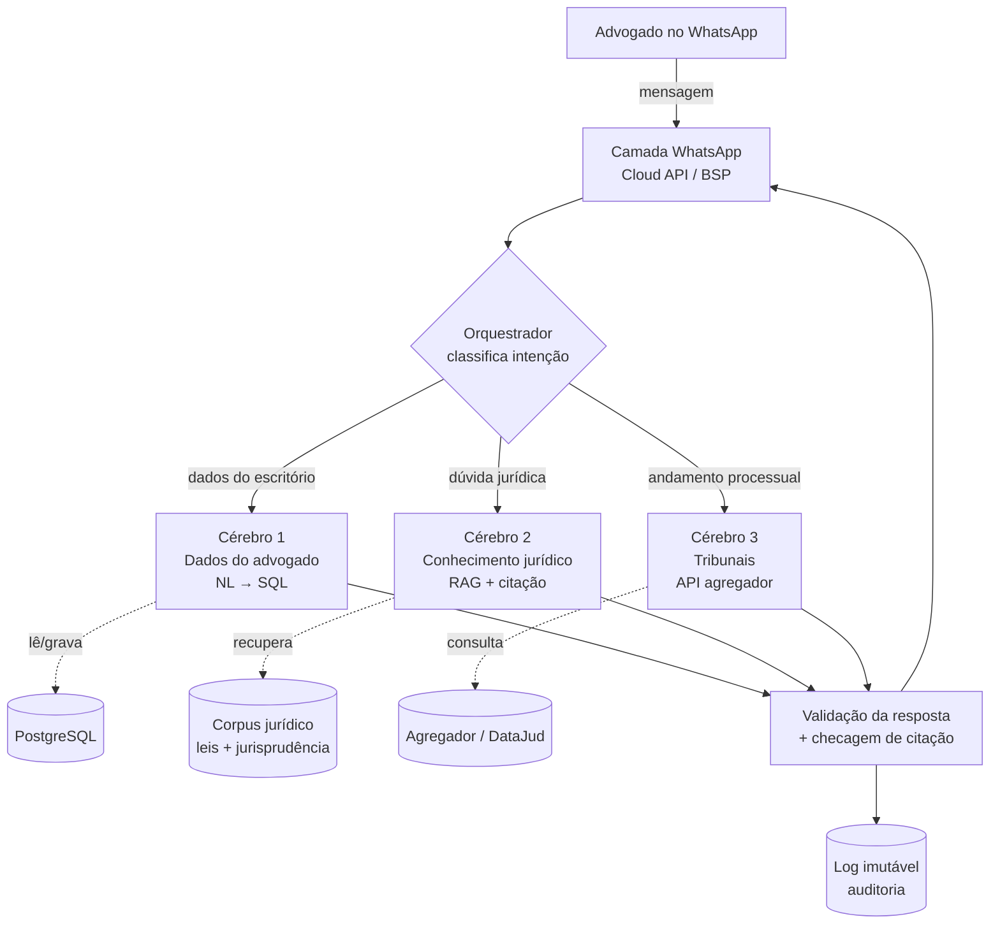

# Planejamento Estratégico — Assistente Jurídico no WhatsApp

> Documento mestre de fundação. Define visão, arquitetura, modelo de dados, compliance e roadmap **antes da primeira linha de código**. Serve para orientar o fundador/time e também para ser lido pelo Claude Code junto com o `CLAUDE.md`.
>
> **Versão 0.1 — fundação.** Revisar ao fim de cada fase.

---

## 1. Visão geral

**O que é:** um assessor jurídico pessoal que vive no WhatsApp. O advogado conversa em linguagem natural e o assistente executa ações (cadastrar processo, marcar audiência, registrar honorário, consultar andamento) e responde dúvidas jurídicas **sempre ancoradas em fonte verificável**.

**Para quem:** advogados autônomos e escritórios de pequeno/médio porte — o público que a própria OAB reconhece ter menos acesso a ferramentas adequadas.

**Proposta de valor (o que nos diferencia):**

1. **Confiabilidade da informação** — nada de IA "achando"; toda resposta jurídica vem com citação da lei/jurisprudência real (RAG). Esse é o nosso fosso competitivo.
2. **Onde o advogado já está** — sem app novo, sem login; é só mandar mensagem.
3. **Segurança e sigilo by design** — tratamento de dados conforme LGPD e Recomendação OAB nº 001/2024.

**Princípio-guia do projeto:** em qualquer decisão de arquitetura ou implementação, priorizar **confiabilidade, robustez e segurança** dos dados e das fontes acima de velocidade ou custo.

---

## 2. Princípios inegociáveis

Valem para todo o sistema e estão refletidos no `CLAUDE.md` e nas skills:

1. **Separação dos três cérebros.** Dados do advogado, conhecimento jurídico e dados dos tribunais são fontes distintas e nunca devem ser misturados num único prompt genérico (ver §4).
2. **Zero alucinação em conteúdo jurídico.** Se não há fonte recuperada, o assistente responde que não encontrou — nunca inventa lei, artigo ou jurisprudência.
3. **Citação obrigatória.** Toda afirmação jurídica carrega a fonte (lei + artigo, ou identificação do precedente).
4. **O advogado é o responsável final.** O produto é ferramenta de apoio; nunca decide nem substitui o juízo profissional. Saídas que viram peça/petição levam aviso de revisão obrigatória.
5. **Sigilo e LGPD por padrão.** Dado de cliente é sensível: minimização, anonimização antes de ir ao LLM quando possível, criptografia e provedores que não treinam com nossos dados.
6. **Idempotência e rastreabilidade no que envolve dinheiro e prazos.** Webhooks de pagamento e cálculos de prazo precisam ser idempotentes, auditáveis e à prova de duplicação.
7. **Tudo logado de forma imutável.** Cada interação (pergunta, ação, resposta, fonte usada) fica registrada para auditoria e defesa em fiscalização.

---

## 3. Decisões de fundação (premissas travadas)

| Tema | Decisão | Observação |
|---|---|---|
| Escopo de construção | Arquitetura completa desde já; **build faseado**; **RAG jurídico desde o início** | Evita re-arquitetura cara; valida com piloto antes de abrir |
| Integração com tribunais | **Agregador pago** (Judit / Escavador / Codilo / Digesto) atrás de uma camada de abstração | Custo aceito em favor de cobertura e confiabilidade; provedor específico definido no módulo |
| Pagamento | **Pix Automático (principal) + cartão recorrente (alternativa)** via camada de abstração; default Asaas | Se já houver gateway no projeto de empresas, troca-se só o adaptador |
| Canal | WhatsApp Business Platform (Cloud API) ou BSP (Twilio/360dialog/Zenvia) | Notificações proativas exigem templates aprovados |
| Banco de dados | **Supabase** (Postgres gerenciado) com RLS, pgvector, Storage e Edge Functions | Escalável para alto volume; RLS garante o isolamento; pooler de conexões para concorrência |
| LLM | Provedor com política de não-treinamento e DPA | Anonimização antes do envio quando aplicável |

> Itens marcados como "default" são trocáveis sem reescrever o sistema, graças às camadas de abstração (ports & adapters).

---

## 4. Arquitetura — os três cérebros

O erro mais comum (e a causa das multas por jurisprudência inventada) é jogar tudo num prompt só. Aqui, o orquestrador **classifica a intenção** da mensagem e roteia para o cérebro certo:

**Cérebro 1 — Dados do advogado (NL→SQL).** Processos, prazos, custos, honorários, documentos. *Não é RAG por embeddings*; é conversão de linguagem natural em consulta/escrita estruturada no Postgres. É a fonte mais confiável: o assistente só lê e grava registros reais.

**Cérebro 2 — Conhecimento jurídico (RAG).** Leis e jurisprudência reais, num corpus curado e citável. Recupera primeiro, responde depois, sempre com a fonte. Se não recuperar, recusa.

**Cérebro 3 — Tribunais (API ao vivo).** Andamento processual via agregador. Consulta sob demanda + monitoramento por webhook.

A camada de **geração de texto** (redigir mensagem, rascunhar peça) é separada da camada de **recuperação de dados** — exatamente como a OAB recomenda.

### Camadas do sistema

- **Canal (WhatsApp):** recebe/envia mensagens, gerencia templates e a janela de 24h.
- **Orquestrador:** classifica intenção, escolhe o cérebro, monta o contexto mínimo, chama o LLM, valida a saída (inclui checagem de citação).
- **Domínio:** regras de negócio (processos, agenda, financeiro, assinatura).
- **Dados:** Supabase (Postgres gerenciado) + pgvector; isolamento por **RLS**; documentos no Storage privado; pooler de conexões para alto volume.
- **Integrações (adapters):** pagamento, tribunais, calendário, storage, LLM.
- **Observabilidade & auditoria:** logs imutáveis, métricas, alertas.

---

## 5. Modelo de dados (entidades principais)

Resumo conceitual; o schema detalhado nasce na Fase 1. O isolamento multi-tenant é garantido por **RLS** em toda tabela com `assinante_id` (ver skill `banco-supabase`).

- **Assinante (Advogado):** `id`, nome, OAB (nº + seccional, validada), CPF/CNPJ, telefone (chave WhatsApp), e-mail, status (trial/ativo/inadimplente/cancelado), plano, consentimento_IA (timestamp + versão do termo).
- **Cliente:** `id`, `assinante_id`, nome, documento, contato. *(dado de terceiro — tratamento sob LGPD)*
- **Processo:** `id`, `assinante_id`, `cliente_id`, numero_cnj, comarca/vara, área, parte_contrária, status, valor_causa, segredo_justica (bool).
- **Movimentação:** `id`, `processo_id`, data, descrição, fonte (agregador), hash.
- **Compromisso/Prazo:** `id`, `assinante_id`, `processo_id`, tipo (audiência/reunião/prazo), data_hora, local, lembrete_em[], origem (manual/extraído).
- **Documento:** `id`, `processo_id`, nome, tipo, storage_ref, enviado_em, classificacao_sigilo.
- **LançamentoFinanceiro:** `id`, `processo_id`, tipo (custo/honorário), valor, vencimento, status, lembrete_cobranca.
- **Assinatura/Pagamento:** `id`, `assinante_id`, gateway_ref, método (pix_automatico/cartao), status, proximo_vencimento, eventos[] (idempotentes).
- **InteraçãoLog (imutável):** `id`, `assinante_id`, timestamp, intenção, entrada, cerebro_usado, fontes_citadas[], saída, anonimizado (bool).
- **ConsentimentoIA:** `id`, `assinante_id`, versao_termo, aceito_em, canal.

---

## 6. Módulos e funcionalidades

⭐ núcleo · ➕ expansão · (Fn) = fase prevista

**Onboarding, identidade e pagamento**
- ⭐ Detecção de número novo → cadastro conversacional (F1)
- ⭐ Validação da inscrição na OAB (F1)
- ⭐ Aceite do termo de consentimento de uso de IA no onboarding (F1)
- ⭐ Assinatura via Pix Automático + cartão; período de teste (F1)
- ⭐ Notificação de vencimento/renovação (respeitando a janela de 24h antes do débito) e suspensão por inadimplência (F1)
- ➕ Planos (solo / escritório multiusuário) (F3)

**Gestão de processos**
- ⭐ CRUD de processo + vínculo a cliente (F1)
- ⭐ Consulta por linguagem natural (F1)
- ➕ Monitoramento automático de movimentações + aviso (F2)
- ➕ Resumo inteligente da última movimentação (F2)

**Agenda, prazos e compromissos**
- ⭐ Cadastro por linguagem natural + lembretes proativos (F1)
- ⭐ Vínculo ao processo/cliente (F1)
- ➕ Cálculo assistido de prazos (com aviso de conferência obrigatória) (F2)
- ➕ Sincronização com Google Calendar (F3)

**Financeiro e honorários**
- ⭐ Registro de custos e honorários por processo (F1)
- ⭐ Lembrete de cobrança de honorário (F1)
- ➕ Relatório financeiro (F2)
- ➕ Geração de cobrança Pix para o cliente final do advogado (F3)

**Assistente jurídico com IA (RAG)**
- ⭐ Perguntas sobre leis reais com citação (F1/F2)
- ⭐ Consulta combinada (dados do advogado + base legal) (F2)
- ⭐ Recusa explícita quando não há fonte (F1)
- ➕ Insights/alertas proativos (F2)
- ➕ Rascunho de peça com aviso de revisão e sem jurisprudência não verificada (F3)

**Documentos**
- ⭐ Upload pelo WhatsApp vinculado ao processo (F1)
- ⭐ Busca de documento por linguagem natural (F2)
- ➕ Extração de dados de PDF (ex.: intimação → sugerir prazo) (F3)

**Back-office**
- ⭐ Painel admin (assinantes, pagamento, uso, churn) (F1)
- ⭐ Logs imutáveis de interação (F1)
- ➕ Métricas de produto (F2)

---

## 7. Fluxos principais (alto nível)

- **Onboarding + pagamento:** número novo → boas-vindas → coleta de dados → validação OAB → termo de consentimento de IA → criação da assinatura (Pix Automático/cartão) → ativação → tutorial curto.
- **Consulta de processo:** mensagem → intenção "consulta" → Cérebro 1 (NL→SQL) → resposta com dados reais do banco.
- **Cadastro de prazo:** mensagem → intenção "agendar" → extração de data/hora/local → confirmação → grava compromisso → agenda lembretes.
- **Pergunta jurídica:** mensagem → intenção "dúvida jurídica" → Cérebro 2 (RAG) recupera fontes → com fonte, responde citando; sem fonte, recusa → log com fontes.
- **Notificação proativa (cobrança/prazo):** scheduler dispara → monta template aprovado → envia → registra. (Fora da janela de 24h só via template.)

---

## 8. Compliance e segurança (resumo operacional)

Baseado em LGPD, Recomendação OAB nº 001/2024, Resolução CNJ nº 615/2025 e boas práticas de mercado. **Isto não é aconselhamento jurídico — validar com advogado/DPO antes do lançamento.**

- **Consentimento:** o advogado aceita, no onboarding, um termo informando o uso de IA (a Recomendação 001/2024 pede formalização prévia ao cliente; o termo também orienta o advogado a repassar isso aos clientes dele).
- **Papéis LGPD:** o escritório/advogado é controlador; nós somos operador. Necessário contrato de tratamento de dados (DPA) com cada assinante e com o provedor de LLM.
- **Sigilo:** dados de cliente são sensíveis. Minimizar o que vai ao LLM; anonimizar/pseudonimizar quando possível; processos em segredo de justiça recebem tratamento reforçado.
- **Provedores:** usar LLM com política de não-treinamento sobre nossos dados e cláusulas de confidencialidade.
- **Segurança técnica:** criptografia em trânsito e em repouso; isolamento por assinante via **RLS do Supabase** (a chave `service_role` ignora RLS — uso restrito a back-office/migrações); documentos em buckets privados com URLs assinadas; segredos fora do código; logs imutáveis.
- **Direitos do titular:** fluxo para acesso/correção/eliminação conforme LGPD.
- **Retenção:** política de retenção e descarte definida.
- **WhatsApp:** mensagens proativas só por templates aprovados; conversa livre só na janela de 24h.

---

## 9. Roadmap por fases

- **Fase 0 — Fundação (agora):** este documento, `CLAUDE.md`, skills, escolha de agregador e gateway, modelagem de dados, política de compliance. *Sem código de produto.*
- **Fase 1 — Núcleo:** onboarding + pagamento, processos, agenda/prazos, financeiro básico, Cérebro 1, recusa-sem-fonte, painel admin, logs.
- **Fase 2 — Inteligência:** Cérebro 2 (RAG completo com citação), monitoramento de movimentações (Cérebro 3), consulta combinada, insights, relatórios.
- **Fase 3 — Piloto e expansão:** 5–10 advogados reais, ajustes, depois abertura comercial; expansões ➕ (multiusuário, calendário, cobrança ao cliente final, extração de PDF, rascunho de peças).

---

## 10. Métricas de sucesso

- Ativação: % de números novos que concluem onboarding + pagamento.
- Retenção / churn mensal.
- Uso por funcionalidade (guia o roadmap).
- Confiabilidade da IA: % de respostas jurídicas com fonte válida; taxa de recusa apropriada; zero jurisprudência inventada.
- Tempo de resposta no WhatsApp.
- Inadimplência e recuperação de cobrança.

---

## 11. Riscos e mitigações

| Risco | Mitigação |
|---|---|
| IA inventar lei/jurisprudência | RAG com citação obrigatória + recusa-sem-fonte + validação da citação contra a fonte |
| Vazamento de dado sigiloso | Anonimização, criptografia, isolamento por assinante via RLS, provedor sem treinamento, logs |
| Dependência de um agregador/gateway | Camada de abstração (adapters) para trocar provedor sem reescrever |
| Bloqueio/limites do WhatsApp | Uso correto de templates, BSP confiável, monitoramento da qualidade do número |
| Cobrança duplicada/falha | Webhooks idempotentes + conciliação |
| Responsabilização do advogado por erro da IA | Avisos de revisão + a IA nunca cita o que não verificou |

---

## 12. Decisões em aberto

- Provedor agregador específico (Judit vs Escavador vs Codilo vs Digesto).
- Gateway final (Asaas vs o já usado no projeto de empresas).
- Stack de orquestração (linguagem/framework herdados do projeto de empresas).
- Fonte e licenciamento do corpus jurídico do RAG (leis: fontes oficiais; jurisprudência: definir cobertura).
